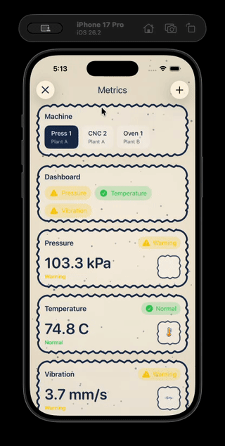
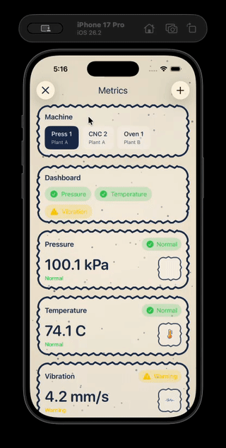

# Telemetry Viewer

A real-time telemetry monitoring iOS application.

---

## Project Overview

This application provides a live metrics dashboard for monitoring various aspects of industrial machines, from temperature sensors to noise levels. Operators can monitor an array of machines using custom-defined metrics for each device, enabling proactive performance management and early anomaly detection.

### Project Goals

This project explores:

- **SwiftUI Development** – Declarative iOS interfaces
- **Real-time Data Patterns** – Live telemetry updates
- **Interactive Dashboards** – Metrics-driven visualization

---

## App Demo

<table>
  <tr>
    <td align="center">
      <strong>Dashboard Overview</strong><br>
      
    </td>
    <td align="center">
      <strong>Metric Drill Down</strong><br>
      
    </td>
  </tr>
  <tr>
    <td align="center">
      <strong>Save New Metric</strong><br>
      
    </td>
    <td align="center">
      <strong>Delete Metric</strong><br>
      
    </td>
  </tr>
</table>

---

### Design Mockups

<table> <tr> <td align="center"> <strong>Main metric page</strong><br>  </td> <td align="center"> <strong>Drill-in metric page</strong><br>  </td> <td align="center"> <strong>Add metric page</strong><br>  </td> </tr> </table>

---

## Technical Highlights

### iOS Application (SwiftUI)

- Implements **MVVM (Model-View-ViewModel)** architecture for clean separation of concerns
- Uses observable properties to decouple UI updates from business logic
- HTTP polling (1-second intervals) for local development simplicity

### Backend Service (FastAPI + Python)

- Lightweight REST API with automatic OpenAPI documentation
- Background telemetry simulator for testing and demonstration

### Data Layer (SQLite)

- Optimized schema with triggers for real-time dashboard caching
- Indexed queries for efficient time-series data retrieval
- Simple deployment for development environments

---

## Quick Start

### Backend

```bash
cd server
python3 -m venv .venv
source .venv/bin/activate
pip install -r requirements.txt
uvicorn app:app --host 0.0.0.0 --port 8000 --reload
```

### iOS App

**Simulator:** Connects automatically to `http://127.0.0.1:8000`.

**Physical Device:**

```swift
static let baseURL = "http://YOUR_MAC_IP:8000"
```

---

# Architecture & Implementation

## iOS App Architecture

### MVVM Design Pattern

The application implements **Model-View-ViewModel (MVVM)** architecture:

- **Separation of Concerns**
- **Testability**
- **Maintainability**
- **Reactive Updates** via `@Published`

```
ios/TelemetryPipeline/TelemetryPipeline/
├── Models/
├── Services/
├── MainScreen/
├── MetricDrilldown/
├── AddMetric/
└── BackgroundTheme/
```

---

## Real-time Data Strategy

**Current Implementation:** HTTP polling every second

**Production Recommendation:** WebSockets for push-based synchronization

---

## Data Flow

1. Fetch machines and metric definitions
2. Poll latest readings
3. Load historical data on demand
4. Compute zone distribution client-side

---

## Technology Stack

| Component         | Technology        | Production Alternative          |
| ----------------- | ----------------- | ------------------------------- |
| iOS App           | SwiftUI + Combine | Same using WebSockets           |
| Architecture      | MVVM              | Same                            |
| Backend           | FastAPI (Python)  | FastAPI + Docker                |
| Database          | SQLite            | PostgreSQL                      |
| Real-time Updates | HTTP Polling (1s) | WebSockets / Server-Sent Events |
| Data Ingestion    | Direct API writes | Message queue                   |

---

## Future Enhancements I would consider

While this implementation uses simplified technologies for local development, a production deployment would include:

- **WebSocket Communication** - Replace HTTP polling with WebSocket connections for reduced latency and server load
- **PostgreSQL Database** - Migrate from SQLite to PostgreSQL for improved scalability, concurrent writes, and advanced query capabilities
- **Containerized Deployment** - Package services in Docker containers with orchestration (Kubernetes/Docker Compose)
- **API Gateway** - Implement proper routing, rate limiting, and authentication between services
- **Message Queue** - Add Kafka for handling high-throughput telemetry ingestion
- **Monitoring & Observability** - Integrate Grafana for service health metrics
